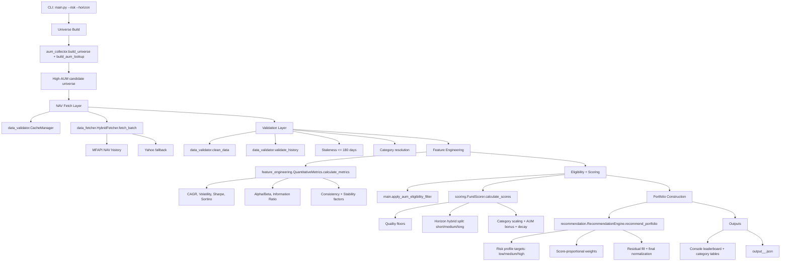

# Mutual Fund Recommendation Engine

Production-oriented Indian mutual fund screening and portfolio recommendation engine with:

- category-aware discovery and filtering,
- quantitative feature engineering,
- hybrid scoring by investment horizon, and
- risk-profile-based portfolio allocation.

---

## What This Repository Contains

This codebase focuses only on the runtime pipeline. Legacy and generated clutter have been removed to keep maintenance simple.

### Core Runtime Files

- `main.py`: orchestration entrypoint and CLI (`--risk`, `--horizon`)
- `data_fetcher.py`: MFAPI/Yahoo fetch logic and benchmark history loading
- `data_validator.py`: data cleaning, stale-history checks, cache manager
- `feature_engineering.py`: metric computation (CAGR, volatility, alpha/beta, drawdown, consistency metrics)
- `scoring.py`: quality floors + hybrid scoring + AUM bonus + diversification decay
- `recommendation.py`: category allocation and weight construction
- `constraints.py`: shared validation thresholds

### AUM Modules (Preserved Intentionally)

- `aum_collector.py`
- `aum_experiment.py`
- `test_aum.py`
- `tests/test_aum_filter_bonus.py`
- `aum_coverage_report.csv`

These were intentionally kept as requested.

---

## Detailed Architecture



---

## End-to-End Dataflow (Detailed)

```mermaid
flowchart LR
    subgraph S1[Stage 1: Inputs and Runtime Setup]
        A1[CLI args: risk + horizon]
        A2[Instantiate fetcher, validator, cache, recommendation engine]
    end

    subgraph S2[Stage 2: Fund Universe and AUM Mapping]
        B1[build_universe(source_mode='combined')]
        B2[build_aum_lookup(universe_source='combined')]
        B3[Attach aum_cr to each discovered fund]
        B4[Pre-filter candidates by AUM and closed-end keywords]
        B5[Resolve scheme code/name via MFAPI search fallback]
    end

    subgraph S3[Stage 3: Data Fetch and Validation]
        C1[Read from CacheManager first]
        C2[HybridFetcher.fetch_batch for misses]
        C3[MFAPI NAV primary + Yahoo fallback]
        C4[clean_data: normalize date/nav columns]
        C5[validate_history: min history + staleness check]
        C6[Drop funds in Other broad category]
    end

    subgraph S4[Stage 4: Feature Engineering]
        D1[calculate_metrics on NAV and benchmark]
        D2[Core metrics: CAGR, volatility, drawdown]
        D3[Risk-adjusted metrics: Sharpe, Sortino, Calmar]
        D4[Market-relative metrics: Alpha, Beta, IR, outperformance]
        D5[Stability metrics: rolling consistency and variance stability]
    end

    subgraph S5[Stage 5: Eligibility and Scoring]
        E1[Reject non-finite metrics]
        E2[apply_aum_eligibility_filter]
        E3[FundScorer quality floors]
        E4[Horizon-based relative/absolute blend]
        E5[Category normalization and multipliers]
        E6[AUM bonus + AMC/subcategory decay]
    end

    subgraph S6[Stage 6: Portfolio Construction]
        F1[Target split by risk profile]
        F2[Per-category top candidate selection]
        F3[Score-proportional weight assignment]
        F4[Residual redistribution]
        F5[Final normalization to full allocation]
    end

    subgraph S7[Stage 7: Outputs]
        G1[Console: top funds + per-category views]
        G2[JSON: top funds, category tops, AUM diagnostics]
    end

    A1 --> A2 --> B1 --> B2 --> B3 --> B4 --> B5 --> C1 --> C2 --> C3 --> C4 --> C5 --> C6 --> D1 --> D2 --> D3 --> D4 --> D5 --> E1 --> E2 --> E3 --> E4 --> E5 --> E6 --> F1 --> F2 --> F3 --> F4 --> F5 --> G1 --> G2
```

---

## Scoring and Allocation Logic

### 1) Quality Floors

Funds are filtered before final scoring using category-aware minimum standards such as:
- alpha floor,
- sortino floor,
- max drawdown limits,
- rolling 1Y positive ratio.

### 2) Hybrid Score

Relative and absolute components are blended by horizon:

- `short`: 40% relative, 60% absolute
- `medium`: 60% relative, 40% absolute
- `long`: 80% relative, 20% absolute

### 2A) Relative Scoring Weights by Horizon (with rationale)

The engine uses weighted normalized metrics. Positive weights reward a metric, negative weights penalize risk.

#### Short Horizon (40% relative, 60% absolute)

| Metric | Weight | Why it is weighted this way |
| :--- | ---: | :--- |
| CAGR | 8% | Some growth, but not dominant for short-term decisions |
| Alpha | 8% | Reward modest benchmark outperformance |
| Sortino Ratio | 15% | Strong emphasis on downside-adjusted return |
| Volatility | -25% | Heavy penalty to unstable return paths |
| Max Drawdown | -20% | Protect capital from deep interim losses |
| Calmar Ratio | 14% | Balance return against drawdown severity |
| Rolling 1Y Positive Ratio | 10% | Prefer consistency of positive yearly outcomes |
| Rolling CAGR Consistency | 5% | Penalize unstable return trend |
| Downside Deviation Stability | 5% | Penalize unstable downside behavior |
| Return Variance Stability | 5% | Penalize variance spikes |
| Benchmark Outperformance Ratio | 5% | Reward persistence of beating benchmark periods |

#### Medium Horizon (60% relative, 40% absolute)

| Metric | Weight | Why it is weighted this way |
| :--- | ---: | :--- |
| CAGR | 22% | Growth becomes more important in medium horizon |
| Alpha | 14% | Larger reward for sustained outperformance |
| Sortino Ratio | 18% | Continue prioritizing risk-adjusted quality |
| Volatility | -12% | Risk penalty remains, but softer than short horizon |
| Max Drawdown | -14% | Control major downside events |
| Calmar Ratio | 10% | Keep drawdown-aware efficiency in ranking |
| Rolling 1Y Positive Ratio | 10% | Keep consistency pressure |
| Rolling CAGR Consistency | 6% | Stability remains meaningful |
| Downside Deviation Stability | 6% | Avoid fragile downside profiles |
| Return Variance Stability | 6% | Reward smoother return structure |
| Benchmark Outperformance Ratio | 5% | Keep market-relative persistence check |
| Excess CAGR vs Benchmark | 3% | Add direct growth-over-benchmark signal |

#### Long Horizon (80% relative, 20% absolute)

| Metric | Weight | Why it is weighted this way |
| :--- | ---: | :--- |
| CAGR | 34% | Return compounding dominates long horizon outcomes |
| Alpha | 18% | Strong emphasis on structural outperformance |
| Sortino Ratio | 16% | Maintain downside-adjusted quality |
| Volatility | -5% | Volatility matters less than long-term growth |
| Max Drawdown | -10% | Still penalize severe loss paths |
| Calmar Ratio | 7% | Ensure drawdown efficiency remains in rank |
| Rolling 1Y Positive Ratio | 10% | Prefer durable positive periods |
| Rolling CAGR Consistency | 8% | Reward persistence in growth trend |
| Downside Deviation Stability | 8% | Reward stable downside profile |
| Return Variance Stability | 8% | Reward smoother long-run behavior |
| Benchmark Outperformance Ratio | 7% | Reward sustained benchmark beats |
| Excess CAGR vs Benchmark | 4% | Additional long-term active edge signal |

### 2B) Absolute Bonus Component

Absolute component adds milestone-style bonuses based on threshold behavior (for example, high CAGR, healthy alpha, controlled volatility, and positive 1Y rolling consistency), then blends with relative score using horizon split.

### 2C) Debt-Specific Weighting

Debt funds use a more stability-heavy weight profile (lower growth emphasis, stronger risk consistency emphasis) so debt is not ranked with an equity-biased lens.

### 3) Category-Normalized Ranking

Scores are normalized inside each broad category (`Equity`, `Hybrid`, `Debt`) before global ordering, reducing cross-category distortion.

### 4) Portfolio Recommendation

- Risk targets are applied from `RecommendationEngine.RISK_PROFILES`.
- Funds are selected per broad category, avoiding excluded subcategories by profile.
- Weights are score-proportional.
- Residual category/portfolio weight is redistributed, then normalized as last resort.

---

## Why High-AUM Filtering Exists

The engine applies category-aware AUM eligibility before final scoring:

- non-debt funds must have `aum_cr > 15000`
- debt funds must have `aum_cr > 5000`

### Why this is useful

1. **Liquidity confidence**
   - Larger AUM funds are typically easier to enter/exit with lower impact and lower liquidity stress.

2. **Operational durability**
   - Higher AUM often correlates with stronger continuity, reducing risk of fragile/small-scheme behavior.

3. **Execution realism**
   - Portfolio recommendations are more implementable when schemes are sufficiently large.

4. **Noise reduction**
   - Very small funds can produce unstable metric profiles; AUM filtering helps reduce false positives from thin histories.

5. **Trust and governance signal**
   - While not a guarantee of returns, larger AUM generally indicates stronger market adoption and monitoring.

### Important caveat

High AUM is treated as a **quality/liquidity proxy**, not as a standalone performance predictor. Final ranking still depends on risk-adjusted quantitative metrics and consistency measures.

---

## Installation

### Requirements

- Python 3.9+
- `pandas`
- `numpy`
- `requests`
- `yfinance`
- `beautifulsoup4`
- `scipy`

### Setup

```bash
pip install pandas numpy requests yfinance beautifulsoup4 scipy
```

---

## Usage

```bash
python main.py --risk medium --horizon long
```

### CLI Arguments

- `--risk`: `low | medium | high` (default: `medium`)
- `--horizon`: `short | medium | long` (default: `long`)

### Example Runs

```bash
python main.py --risk low --horizon short
python main.py --risk medium --horizon medium
python main.py --risk high --horizon long
```

---

## Output

Each run writes:

- console tables (top funds + per-category top picks),
- JSON file in project root:
  - `output_<risk>_<YYYYMMDD_HHMM>.json`

JSON includes top-ranked funds and AUM diagnostics extracted during filtering.

---

## Testing

Run the active tests:

```bash
python -m unittest tests/test_aum_filter_bonus.py
```

---

## Cleanup Performed In This Refactor

The following cleanup was applied:

- removed generated runtime artifacts (`output_*.json`) from repository root,
- removed stale cache artifacts in `.pytest_cache/`,
- removed legacy/dead modules not used by runtime:
  - `config.py`
  - `diagnostics.py`
  - `tests/test_v3_core.py`
- simplified redundant code in:
  - `recommendation.py` (duplicative residual helper and redundant expression cleanup),
  - `feature_engineering.py` (unused imports removed),
  - `main.py` (unused counter removed),
  - `constraints.py` (reduced to actual shared thresholds used by runtime).

---

## Troubleshooting

- **No candidates after filtering**
  - check network/API availability,
  - try `--risk high` for a broader universe,
  - clear `.cache/` and re-run.

- **Benchmark-related alpha/beta instability**
  - Yahoo benchmark data may have intermittent gaps; rerun later.

- **Very small or sparse portfolios**
  - strict quality + staleness + AUM filters can reduce eligible funds by design.

---

## Disclaimer

This project is for research and educational use. It is **not** investment advice. Validate recommendations independently before any allocation decision.

